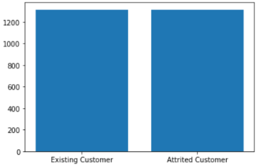

# **Predicción de la cancelación o no de una tarjeta bancaria de un cliente**

-----
### Este proyecto va a consistir en el análisis, exploración de datos y creación de un modelo de red neuronal para la predicción de si un cliente va a cancelar o no una tarjeta o cuenta bancaria asociada para poder preveerlo y ofrecerle mejores servicios u otras opciones haciendo que no se vaya. Para ello se han usado diferentes herramientas y librerías enfocadas a las redes neuronales neuronales.


-----

### Organización de carpetas: 

* scr/
    * data/: Contiene los archivos usados en el proyecto.
    
    * Images/: Contiene imágenes usadas en este archivo Markdown.

    * Modelo/ : Contiene los modelos predictivo de este proyecto.

    * notebooks/: son archivos jupyter notebook usados en todo el proceso.

------

### Fuente: [Kaggle](https://www.kaggle.com/datasets/sakshigoyal7/credit-card-customers)

------

### En este proyecto de pueden apreciar conocimientos en:

* Python
* Deep Learning
* Keras
* TensorFlow
* transformación de datos
* Análisis de datos
* Supervised Learning
* Visualizaciones
* Classifier Models

------

## **Importación de los datos**

#### Leemos el csv que en el que tenemos los datos para empezar con el proyecto. Inicialmente tenemos 23 variables y tenemos tanto de tipo numérico como de tipo texto.

```py
data.dtypes.unique()
output: array([dtype('int64'), dtype('O'), dtype('float64')], dtype=object)
```
#### Vemos que es un dataset desbalanceado.


#### Reemplazamos las etiquetas de la columna objetivo a numeros (0: cliente que sigue, 1: cliente que se fue), cambiamos las columnas de tipo texto a tipo numérico y eliminamos la oclumna de "CLIENTNUM".


Al final nos quedamos con 37 variables predictoras y una variable objetivo.

columnas|
---|
'Attrition_Flag'
'Customer_Age'
'Dependent_count'
'Months_on_book',
'Total_Relationship_Count'
'Months_Inactive_12_mon',
'Contacts_Count_12_mon', 'Credit_Limit'
'Total_Revolving_Bal',
'Avg_Open_To_Buy', 'Total_Amt_Chng_Q4_Q1'
'Total_Trans_Amt',
'Total_Trans_Ct'
'Total_Ct_Chng_Q4_Q1'
'Avg_Utilization_Ratio',
'Gender_F', 'Gender_M'
'Education_Level_College',
'Education_Level_Doctorate'
'Education_Level_Graduate',
'Education_Level_High School'
'Education_Level_Post-Graduate',
'Education_Level_Uneducated'
'Education_Level_Unknown',
'Marital_Status_Divorced'
'Marital_Status_Married',
'Marital_Status_Single'
'Marital_Status_Unknown',
'Income_Category_$120K +'
'Income_Category_$40K - $60K',
'Income_Category_$60K - $80K'
'Income_Category_$80K - $120K',
'Income_Category_Less than $40K'
'Income_Category_Unknown',
'Card_Category_Blue'
'Card_Category_Gold'
'Card_Category_Platinum',
'Card_Category_Silver'

## Creación del modelo

#### Creamos las capas del modelo con las siguientes características
capas | Número de neuronas| Función de Activación
------|-------------------|--------
1|37|Relu
2|150|Relu
3|300|Relu
4|400|Relu
5|300|Relu
6|150|Relu
7|1|Sigmoide

#### Escogemos como ultima función de activación la función sigmoide ya que es un problema de clasificación binaria en el que viene bien este tipo de función de activación.

#### De optimizador he elegido "Adam", de función de coste "binary_crossentropy" y como métrica para medir el rendimiento del modelo "Accuracy".

Optimizador| Función de coste| Métrica
-------|--------------------|--------
Adam|Binary Crossentropy|Accuracy

## Entrenamiento del modelo

#### Para el entrenamiento escogemos un Batch de 32 para que el modelo vaya más rapido y unas 50 epocas para que aprenda.
Batch_size| Epochs| Validation_split
-----|------|--------
32|50|20%

#### Con este modelo hemos conseguido un Accuracy de 0.89, veamos si lo podemos mejorar.

## Mejora del modelo

## Le aplicamos un StandardScaler para escalar los datos.

#### Esta vez nos ha dado un Accúracy de 0.92. Veamos si lo podemos mejorar todavía más

## Segunda Mejora

#### Como vimos que los datos estaban desbalanceados vamos a probar a tener los mismos datos pertenecientes a las dos etiquetas a ver cual es su rendimiento.

#### Ahora en vez de 10000 datos apoximadamente tenemos 2630 en el que hay el mismo numero de datos para cada etiqueta que tenemos.



#### Esta vez nos ha dado un Accuracy de 0.91. Vemos que no ha mejorado pero tampoco empeorado considerablemente.

## Evaluación

#### Veamos la confussion Matrix del modelo en la que las columnas indican el calor predicho y las filas el valor real. Nos indica un ratio para cada conjunto de (valor predicho, valor real) en forma de matriz.


#### Veamos otras métricas para evaluar el modelo. Antes vimos un accuracy de 0.91 que indica los que ha clasificado bien vs todas las predicciones que hizo, la métrica de Precission nos dice que, de todas las que ha predicho de la clase 1, el 67% las ha acertado y la metrica de Recall nos indica que, de todos los positivos que había predicho bien, cuantos en realizad había y nos da una puntuación del 0.71.

